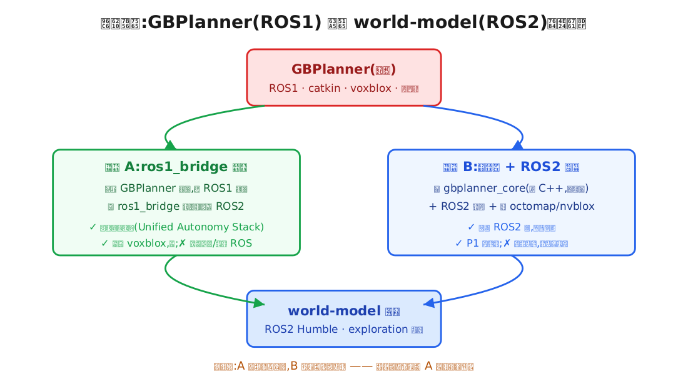
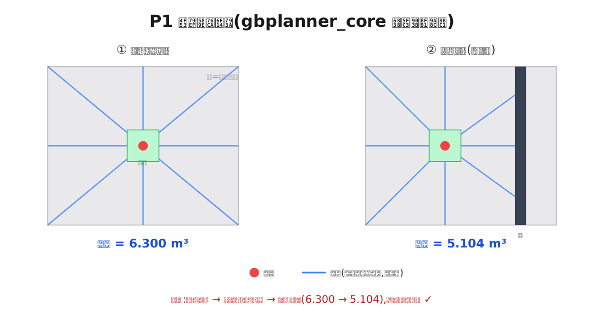

# GBPlanner → World-Model 集成项目

> 把 **GBPlanner 自主探索算法** 加入 **world-model 仿真平台**,替换其占位探索策略。
> 本文 = 项目**蓝图 + 全景理解 + 集成方案 + 进展日志**,面向"看懂 + 做报告"。
> 📖 **零基础友好**:正文里每个英文缩写第一次出现都就地解释;不懂的词也可直接翻到**文末第 5 部分·名词表**(按类别详解)。最后更新:2026-07-04。

---

# 🗺️ 路线图·你在这里(2026-07-04)

```
线路1·预研B(复现GBPlanner)  ██████████ 100% ✅ 终点:自主探索全闭环+量化(291m/13万体素/地图落盘)
线路2·预研A(跑通world-model) █████████░ ~90%  ◉◉◉ ← 你在这里(2026-07-04)
   9/9镜像✅ → 35轮受控实验修掉13坑(总根因=RSP崩机器人未生成、编排真凶=uid无passwd致gz分区错乱…)
   → 感知层全通(/scan /tf /imu)✅ → SLAM闭环(quality=tight,/slam/odom)✅ → 位姿回灌飞控(pose_samples=153)✅
   ◉ 当前站:FCU bootstrap(坑#14候选:控制器请求mode 15=AUTOTUNE而非4=GUIDED;PreArm VisOdom)
   ○ 下一站:解锁起飞 → frontier_lite 真实指标 → 终点
   战役全解:docs/预研A排错战役实录_35轮实验全解.md
线路3·集成                   ██████░░░░ ~60%  决策层原型✅+真版桥接地基✅;完整桥接等线路2通车
线路4·量化对比               ███░░░░░░░ ~30%  GBPlanner侧实测✅入库;frontier_lite侧等线路2
```

# 🔴 最新全景状态(2026-07-03)

| 环节 | 状态 |
|---|---|
| 集成决策 | ✅ 「桥接方案(ros1_bridge)」 |
| 预研B·GBPlanner 仿真镜像 | ✅ `gbplanner-ref` 已建 |
| **🟢🟢 预研B·官方仿真自主探索全闭环(2026-07-02)** | ✅ **完成+量化!** 排 6 坑后实测:起飞→voxblox 3D 建图→RRG 规划→自主巡飞→**480s 预算 t=435s 自动返航**。全程量化:**路径 291.3m、地图峰值 132,091 点**(70 采样点曲线 `images/exploration_metrics_full.png`),地图落盘 `explored_map_lightboxes.vxblx`。复现:`run_light.sh`+`takeoff_and_explore.sh`;[docs/预研B_仿真实跑排错记录.md](docs/预研B_仿真实跑排错记录.md) |
| P1·算法核心(光线投射+体积增益) | ✅ 编译+ctest 通过 |
| 接口规格 / 对比设计 / 图文手册 | ✅ 已出(真截图待跑通补) |
| **预研A·world-model 9 镜像** | ✅ **9/9 全部构建成功(实测)**——排掉 6 个 jazzy→humble 兼容坑 |
| **🟢 真集成代码(决策层,ROS2-native)** | ✅ **已接进 world-model 真实结构**——新增可选策略 `gbplanner_gain`(读 `/map`、体积增益选向),`go build/vet/test` + `py_compile` 全过 |
| **🟢 阶段4 桥接地基(接真版 GBPlanner)** | ✅ 从源码逐条证实真版 I/O 契约(点云/里程计进、`MultiDOFJointTrajectory` 出、自定义 msg 留 ROS1 不跨桥)+ ROS2 出口适配器(`integration/ros1_bridge/`) |
| **🟢 35轮实验连修 13 个 humble 真坑(全实证)** | ✅ ①tomllib ②空launch参数 ③模板`%%` ④venv悬空软链 ⑤setup.bash缺失 ⑥rclpy版本(Py3.14→3.10) ⑦ydlidar驱动必需+declare_parameter 26处补丁 ⑧QoS不兼容 ⑨**总根因:sdformat_urdf 不认 gpu_lidar→RSP崩→机器人从未生成** ⑩CYCLONEDDS漏发 ⑪SDF1.11版本 ⑫**编排真凶:uid无passwd→gz分区错乱→容器互相隐身** ⑬IMU自吞回声。感知层全通→SLAM闭环(tight)→位姿回灌飞控。全证据链:[docs/运行时排错记录_humble.md](docs/运行时排错记录_humble.md)、[战役实录](docs/预研A排错战役实录_35轮实验全解.md) |
| **PR/bugfix 物料(留档)** | ✅ [integration/world-model-PR/](integration/world-model-PR/)——按你拍板**不对外提交**,作为"改动可用、有含金量"的证据存档 |
| **跑 exploration(看 frontier_lite)** | 🔵 感知层全通(/scan /tf /imu)→SLAM闭环(quality=tight,/slam/odom)→位姿回灌飞控(pose_samples=153);当前站 FCU bootstrap(坑#14候选:控制器请求 mode 15=AUTOTUNE 而非 4=GUIDED) |
| 量化对比 | ⬜ 待运行时完全跑通后做 |

- 🎯 **任务主线**:GBPlanner 决策已作可选策略 `gbplanner_gain` 接进 world-model 真实结构;桥接真版地基已落(契约+适配器);连修 9 个 humble 真坑把平台推到最后一层。**按你拍板不对外提交**,[integration/world-model-PR/](integration/world-model-PR/) 物料仅留档(证明改动可用、有含金量)。
- **你怎么自己验证 9/9**:打开 WSL 敲 `docker images | grep navlab`(应数到 9 个)。详见 [docs/WSL使用与复现.md](docs/WSL使用与复现.md)。
- **你怎么自己验证集成代码**:WSL `cd ~/ws/world-model && git log --oneline -2`(看到 fix+feat 两提交);渲染脚本证据在 `integration/world-model-PR/rendered_*.py`。
- **看仿真画面**:[docs/实跑操作手册_图文版.md](docs/实跑操作手册_图文版.md)。
- 🎯 **核心发现(任务准星)**:world-model 的 `frontier_lite` 经查证**是脚本预设动作**(前进+扭头按计时器循环,**不订阅地图**),**不是探索算法**;GBPlanner 的精确插入点 = 这个探索决策节点。详见 **[docs/集成机制与frontier_lite缺陷_核心发现.md](docs/集成机制与frontier_lite缺陷_核心发现.md)**。
- ✅ **可运行成果(可演示·真能跑)**:`gbplanner_core` 决策演示——对每个方向算体积增益、选最高且避障,出俯视决策图(`images/gain_decision.png`)。30 秒可自己复现,详见 **[docs/算法核心演示_体积增益选路.md](docs/算法核心演示_体积增益选路.md)**。这是整个任务里**真正跑通、贴 mentor md 核心**的成果。
- **新窗口无损接管**(给下一个 Claude 读):[RESUME_恢复文档.md](RESUME_恢复文档.md)。

---

# 第 0 部分 · 蓝图速览(一页看懂)

**我们在做什么:** 给一个无人机仿真平台(world-model)换上一个更聪明的"自主探索大脑"(GBPlanner)。

**为什么:** world-model 现在的探索功能是个**临时凑数的简易版**(代号 `frontier_lite`),只能在 2D(平面)地图上凑几个目标点。GBPlanner 是学术界成熟的 **3D(立体)体积增益探索算法**(来自美国 DARPA 地下机器人挑战赛冠军队 CERBERUS),能真正"算出哪条路看见的未知空间最多"。

**怎么换(关键认知):** world-model 的探索模块,本质是"往几个固定的消息频道(ROS 话题)发布'去哪个目标点 / 走哪条路'"。**集成 = 写一个 GBPlanner 模块,产出目标点/路径,发到同一组频道,把简易版顶替掉。插口不变,只换大脑。**(就像把汽车的自动驾驶模块从简陋版换成高级版,线束插口一样,只换里面的算法。)

**整体路线:**
| 阶段 | 名称 | 内容 | 状态 |
|---|---|---|---|
| P0-A | 复现 world-model | 跑通平台,看占位探索怎么工作 | 🔵 **~90%(07-04)**:9/9镜像✅+35轮实验修13坑;感知层全通→SLAM闭环→位姿回灌飞控;当前站 FCU bootstrap(坑#14候选) |
| P0-B | 复现 GBPlanner | 单独跑官方算法,看它怎么探索 | ✅ **完成(2026-07-02):自主探索全闭环实测**(291.3m/435s/地图落盘) |
| P1→桥接 | 桥接路线落地 | 已选桥接方案:搭 ros1_bridge + 适配 + 加 3D 雷达 | 🟡 核心已起步(测试通过),路线改为桥接,见 TASKS.md |
| P2 | ROS2 节点 | 把核心包成 ROS2 模块,接 world-model 数据 | ⚪ 未开始 |
| P3 | 编排集成 | 替换 frontier_lite,通过现有验收检查 | ⚪ 未开始 |

> P0~P3 是我给阶段起的编号(P=Phase 阶段)。

## 历史里程碑存档(2026-06-29 当日速览,保留不删)

**① 已核实:GBPlanner 确为 ROS1**(`package.xml` 用 catkin/roscpp;仓库 16 个分支无任何 ROS2 分支)。**并挖到关键事实:算法作者自己用 `ros1_bridge` 把 GBPlanner 接进 ROS2 系统(其 Unified Autonomy Stack),于是集成出现两条路** —— 这条"官方捷径"是你追问 ROS 版本时挖出来的:



**② P1 核心库第一块完成**:写出 `gbplanner_core`(纯 C++、无框架),实现算法心脏"光线投射 + 体积增益",并**编译 + 单元测试全部通过**。演示验证了"挡住一侧 → 增益下降"的正确逻辑:

| 场景 | 体积增益 | 说明 |
|---|---|---|
| 开阔未知环境 | **6.300 m³** | 视线四面看见大量未知空间 |
| 一侧加墙(已占据) | **5.104 m³** | 被挡侧看不见 → 增益下降 ✓ |
| 单元测试 | **1/1 通过** | 射线遇障停止、加墙增益下降等断言全过 |



> ✅ **已决策(你拍板)**:集成采用「**桥接方案(ros1_bridge)**」——作者官方做法。原 P1 据此重规划为"搭桥 + 适配"工作;已写的 `gbplanner_core` 转为备选/加深理解,不浪费。
> **命名提醒(消除歧义)**:**预研 A/B = 复现任务**(A=复现 world-model,B=复现 GBPlanner);**桥接/重写 = 集成方案**(不再用字母)。
> ✅ **预研 B 参考镜像已构建成功**(`gbplanner-ref`,GBPlanner 的 ROS1 环境可复现)。任务进度看板见 [TASKS.md](TASKS.md);当日进展见 [notes/进展_2026-06-29.md](notes/进展_2026-06-29.md)。

---

# 第 1 部分 · 全景理解(报告用)

## 1.1 world-model 是什么

⚠️ **先破除一个误会**:维护者本人说,"world-model" **不是**人工智能领域那个热门的"世界模型(world model)"概念,只是他给这个任务随手起的名字,**没用到任何'世界模型'技术**。

它实际是:**一个面向室内、无 GPS 环境的无人机"仿真 + 调度"平台**。把它想象成一个"无人机虚拟实验台的总控台":

| 组成 | 用的技术 | 作用(大白话) |
|---|---|---|
| 仿真器 | **Gazebo** | 造一个虚拟 3D 世界,让虚拟无人机在里面飞、撞、被传感器扫描 |
| 飞控 | **ArduPilot SITL** | 纯软件模拟的真实飞控(管姿态/油门),SITL=软件在环 |
| 建图定位 | **Cartographer**(2D) | 无人机靠激光雷达边飞边画地图、算自己在哪(这类技术叫 SLAM) |
| 总调度 | **Go 语言**写的程序(`navlab-sim`) | 决定启动哪些部件、跑哪个任务、收集结果 |
| 通信约定 | **Protobuf**(协议缓冲) | 让 Go/Rust/Python 各模块用统一数据格式对话 |
| 打包 | **Docker**(容器) | 每个部件装进"集装箱",一键复现、不污染本机 |
| 通信框架 | **ROS2**(机器人操作系统第 2 代) | 机器人界的"消息总线",各模块通过"话题"发/收消息 |

它内置 **5 个仿真任务**:`exploration`(探索)、`hover`(悬停)、`navigation`(导航)、`hover-slam-only`、`scan-robustness`(抗扰动)。**我们只动 `exploration` 这一个。**

**exploration 现状(占位 frontier_lite):** 一个轻量的 Python 小程序,用 Cartographer 画的 **2D 地图**找"边界"(frontier,已知与未知的交界),以 0.1 米/秒、26 秒、凑 ≥3 个目标点的方式驱动无人机,**只为证明"探索流水线通了",不是真正的探索算法**。这就是我们要替换的对象。

## 1.2 GBPlanner 是什么

**论文:** CERBERUS 团队(arXiv:2201.07067),源自 DARPA 地下挑战赛。**官方代码:** 网址 `github.com/ntnu-arl/gbplanner_ros`,用其中的 `gbplanner2` 分支。

**它怎么工作(6 步大白话):**
1. 无人机靠 **3D 激光雷达**边飞边建一张 **3D 占据地图**——空间被切成无数小方块(体素),每块标记为"已占据 / 空闲 / **未知**"。
2. 在身边空间**随机撒点、连成一张"候选路线网"**(这套方法叫 RRG,快速随机图)。
3. 对每条候选路线,用**光线投射**(从视点发虚拟射线数能看到多少未知方块)算出**体积增益**——即"这条路能新看见多少未知空间"。
4. 再减去"绕远的距离惩罚 + 频繁转向的惩罚",**选出增益最高且不撞墙的路**。
5. 如果身边都探完了(没增益),就去全局地图找还没探的**边界(frontier)**。
6. 输出一串**目标航点(waypoint)**,让无人机依次飞过去。

**集成时要对接的技术事实:** GBPlanner 是 **ROS1**(机器人操作系统第 1 代,比 world-model 的 ROS2 老一代)写的;它自带的建图库叫 **voxblox**;输入是 3D 点云 + 里程计,经一个叫 **PCI**(规划-控制接口)的模块输出航点。

## 1.3 三道"错配"(集成的真正难点)

这三点是报告里"为什么这事不是简单复制粘贴"的核心论据:

| # | 错配 | 通俗解释 | 我们的对策 |
|---|---|---|---|
| 1 | **ROS1 ↔ ROS2** | 算法用老框架(ROS1)写,项目是新框架(ROS2),两代**不直接互通**,像方言不同 | 把算法**抽成不依赖框架的纯核心**,再用 ROS2 重新包一层外壳 |
| 2 | **建图库 voxblox 只支持 ROS1** | 算法自带的 3D 建图工具搬不到新框架 | 换成 ROS2 能用的建图库(octomap,或用显卡加速的 nvblox) |
| 3 | **传感器/控制器不同** | 项目的仿真无人机只有 **2D 雷达**,而算法要 **3D**;算法原版用 RotorS 控制器,项目用 ArduPilot | 给仿真无人机**加 3D 雷达**;航点输出**改走 ArduPilot** |

---

# 第 2 部分 · 集成方案蓝图

## 2.1 接口契约(已从源码精确提取出来)

frontier_lite(要替换的)会把结果发布到下面这组"消息频道"(ROS 话题),**GBPlanner 替换后,只要发到同一组频道即可**:
- `/navlab/exploration/goal`(目标点)、`/path`(路径)、`/frontiers`(边界)、`/status`(状态)、`/coverage`(覆盖率)、`/markers`(可视化标记)
- 控制链:`/navlab/fcu/setpoint/intent` → `/output` → ArduPilot 飞控(fcu=飞控单元)

**验收检查**(项目里 Go 写的 `gate_evaluation.go`,gate=关卡/闸门)只看结果指标:成功目标数 ≥3、路径长度 ≥0.35 米、有覆盖增长等。**GBPlanner 只要能驱动 ≥3 个目标、地图有新增覆盖,就算通过这道关卡。**

## 2.2 分层设计(为什么要"抽核心 + 包外壳")

```
[3D 雷达(需给仿真无人机加)] → [里程计 + 点云]
   → [ROS2 的 3D 建图: octomap / nvblox]      ← 替代只支持 ROS1 的 voxblox
      → gbplanner_core(纯 C++ 核心,不绑定任何框架:RRG 撒点 / 光线投射 / 算体积增益)
         → ROS2 外壳节点:把结果发到 /navlab/exploration/*  → 驱动 ArduPilot 飞
```
- **核心层 `gbplanner_core`**:纯算法,不绑定 ROS、不绑定 voxblox(靠两个"抽象接口"——地图接口、可通行接口——与外界解耦)。这样**同一套算法既能配 ROS1 也能配 ROS2**,这是跨越"错配 1、2"的关键设计。
- **适配层(外壳)**:ROS2 节点,负责把核心接到 world-model 的真实数据和频道上。

## 2.3 交付物清单(这个项目最终要产出什么)
gbplanner_core 核心库 + 两个抽象接口 + ROS2 外壳节点 + ROS2 的 3D 建图前端 + 给仿真无人机加 3D 传感器 + 一个 Docker 镜像 + 改 `exploration.yaml` 配置 + 离线测试 demo + 通过 exploration 验收的集成测试。

---

# 第 3 部分 · 进展日志(每一步:做了什么 / 为什么 / 影响 / 报告怎么讲)

## 步骤 1 · 全景调研(把两个仓库的源码读透)
- **做了什么:** 深挖 world-model 与 GBPlanner 两个代码仓库,确认技术栈、数据流向、接口、三道错配。
- **为什么:** 信奉"看懂再动手"——不摸清就写代码必定返工。
- **对项目影响:** 得到精确的集成契约(见第 2 部分),把"无从下手"变成"有蓝图"。
- **报告怎么讲:** "我们先做了完整技术调研,确认 world-model 是 ROS2 仿真平台、GBPlanner 是 ROS1 算法,识别出三道集成鸿沟。"
- **产物:** [施工手册](GBPlanner集成施工手册.md)、[notes/exploration集成接口](notes/exploration集成接口_frontier_lite.md)。

## 步骤 2 · 开发环境搭建(已验证)
- **做了什么:** 在这台新电脑从零配好开发环境(下表),并克隆项目仓库。
- **为什么:** GBPlanner/ROS 必须在 Linux 上跑;项目用 ROS2 Humble,对应 Ubuntu 22.04;全程用 Docker。
- **对项目影响:** 具备了"能跑、能编译"的底座。
- **报告怎么讲:** "搭建了 WSL2 + Docker + ROS2 工具链开发环境,并成功克隆与启动项目调度器。"

| 层 | 装了什么 | 验证结果 |
|---|---|---|
| Windows | 真 Python3.12 / uv / Node / gh / pandoc + VS Code 插件 | ✅ |
| WSL2(Windows 里的 Linux) | Ubuntu 22.04.5(登录名 ai4s) | ✅ |
| Docker(容器) | 29.6.1 + Compose(配了代理) | ✅ 跑通 `Hello from Docker!` |
| 编译工具链 | gcc/g++11、cmake3.22、**Go 1.24** | ✅ |
| 项目仓库 | `~/ws/world-model` 已下载 | ✅ |

**关键结果(2026-06-29 本机真实运行验证,Go 1.24):**
```
$ go run ./cmd/navlab-sim doctor          # 平台自检
NavLab Sim Doctor
OK config loaded
OK task registry configured
backend=docker   task_count=5
$ go run ./cmd/navlab-sim list-tasks      # 列出平台内置 5 个任务
exploration       sim  Official-maze exploration gate over Gazebo/SITL.   ← 我们要改的
hover             sim  SITL hover gate over Gazebo with SLAM and landing checks.
hover-slam-only   sim  SLAM-only hover preflight ...
navigation        sim  Nav2 indoor navigation gate over Gazebo/SITL.
scan-robustness   sim  Airframe disturbance and scan robustness gate.
```
> 诚实纠错:本表此前是从仓库源码读来的、并非实跑;现已在本机**真实运行**得到上述输出。
- **遇到并解决的坑(报告加分项,体现工程能力):**
  1. Windows 自带的 `python` 是应用商店占位假货,装了真 Python 3.12。
  2. Go 版本:装了 Go 1.24(在 `/usr/local/go/bin`),但 apt 的旧 Go 1.18 在 PATH 前面把它盖住 → `go run` 报版本错;**把 `/usr/local/go/bin` 置于 PATH 前**(写进 `~/.bashrc`)才生效。
  3. **Docker 后台服务(守护进程)不走代理** → 单独给它配代理,才能下载镜像。
  4. WSL 没把 Windows 的代理共享进去 → 开启 WSL"镜像网络"模式。
- **产物:** [环境搭建 runbook(操作手册)](runbooks/01_环境搭建_WSL2_Docker_P0.md)、[环境就绪状态](notes/环境就绪状态_2026-06-29.md)。

## 步骤 3 · 读懂占位探索 frontier_lite
- **做了什么:** 读源码确认 frontier_lite 是 2D 简易探索,并提取出 GBPlanner 接入的精确"消息频道契约"。
- **报告怎么讲:** "明确了被替换对象的行为与接口,得到 GBPlanner 的精确接入点。"
- **产物:** [exploration 集成接口](notes/exploration集成接口_frontier_lite.md)。

---

# 第 4 部分 · 预研 A / B(待执行,做完各出一份单独 md)
- **预研 A = 复现 world-model**:构建镜像、真跑 exploration 任务,亲眼看占位探索在仿真里飞。⚠️ 成本大(首次约 1–2 小时构建 + 几十 GB),**动手前我会先征求你同意**。完成后出 `docs/预研A_复现worldmodel.md`。
- **预研 B = 复现 GBPlanner**:用已写好的一键 Docker 配置跑官方仿真,看算法行为、抄参数。成本中(约 10–25 分钟编译)。完成后出 `docs/预研B_复现gbplanner.md`。

---

# 第 5 部分 · 名词表(分类详解,报告/自学备查)

> 格式:**英文/缩写**(中文名)— 大白话解释 + 在本项目里指什么。

## A. 机器人软件框架(最重要,集成难点的根源)
- **ROS**(Robot Operating System,机器人操作系统)— 名字叫"操作系统",其实**不是** Windows 那种系统,而是一套**让机器人的各个程序模块互相发消息、协同工作**的软件框架。核心两个词:模块叫"节点",模块间靠"话题"传消息。
- **ROS1 / ROS2** — ROS 的两代。ROS1 老(2007 起),ROS2 是重写的新版(更适合多机/实时)。**两代不直接互通**——这是本项目集成的头号难点。GBPlanner 是 ROS1,world-model 是 ROS2。
- **节点**(node)— ROS 里一个独立运行的程序模块(一个"参与者")。
- **话题**(topic)— 模块之间传消息的"频道/广播台",一方发布、另一方订阅。例:`/scan`(激光数据)、`/map`(地图)。
- **catkin / colcon / ament** — ROS 的"编译打包工具"。catkin 属 ROS1;colcon+ament 属 ROS2。
- **ROS 发行版**(distro)— ROS 的版本代号(像 Ubuntu 有版本名)。ROS1 的 **Noetic**(配 Ubuntu 20.04);ROS2 的 **Humble**(配 22.04)、**Jazzy**(配 24.04)。

## B. 仿真与飞控
- **Gazebo** — 一个 **3D 物理仿真器**:造虚拟世界 + 虚拟机器人,模拟重力/碰撞/传感器。"headless(无头)"= 不开图形界面,只在后台算,省资源。
- **ArduPilot** — 开源的**无人机飞控软件**(管姿态、油门、航线)。
- **SITL**(Software In The Loop,软件在环)— 把飞控**纯软件模拟**跑起来(不接真实飞控硬件),用于在电脑里测试。
- **MAVLink** — 地面站与飞控之间的**通信协议**(发指令、收状态用的"普通话")。
- **FCU**(Flight Control Unit,飞行控制单元)— 即"飞控",无人机的"小脑",直接驱动电机。
- **iris** — Gazebo/ArduPilot 里一个常见的**四旋翼无人机模型**名;`iris_with_lidar` = 带激光雷达的 iris。
- **Nav2** — ROS2 的标准**导航系统**(走到指定点、避障),项目的 navigation 任务用它。

## C. 建图与定位
- **SLAM**(Simultaneous Localization and Mapping,同步定位与建图)— 机器人**边走边画地图、同时算出自己在地图哪里**的技术。无 GPS 室内必备。
- **Cartographer** — 谷歌开源的一个 SLAM 软件;本项目用它做 **2D** 建图。
- **Fast-LIO** — 一个 **3D 激光-惯性 SLAM**(用 3D 雷达 + 惯性传感器),精度高、速度快。
- **占据栅格地图**(occupancy grid)— 把空间切成小格子,每格标记**已占据(occupied,有障碍)/ 空闲(free)/ 未知(unknown,还没探到)**。GBPlanner 就靠"未知"格子来探索。
- **体素**(voxel,= volume 体积 + pixel 像素)— 3D 版的"格子",3D 地图的最小立方块单位。
- **voxblox / octomap / nvblox** — 三种把激光**点云转成 3D 占据地图**的软件库。voxblox 只支持 ROS1(所以要换);octomap 经典通用;nvblox 是英伟达的 **GPU 显卡加速**版。
- **TSDF / ESDF** — voxblox 内部的地图表示法(记录"到最近障碍的距离"),用于判断空旷与碰撞。(了解即可)
- **里程计**(odometry)— 机器人对**自己运动/位置的估计**(走了多远、转了多少角)。话题常叫 `/odom`。
- **TF**(transform,坐标变换)— ROS 里管理**各坐标系之间换算**的机制(如"地图坐标系"与"机身坐标系"的关系)。
- **点云**(point cloud)— 激光雷达扫出来的**一大片 3D 点**,勾勒周围物体表面。

## D. 探索算法相关
- **GBPlanner**(Graph-Based Planner,基于图的规划器)— 本项目要集成的探索算法。
- **CERBERUS / DARPA SubT** — CERBERUS 是研发 GBPlanner 的团队名;DARPA SubT(Subterranean Challenge,地下挑战赛)是美国国防部 DARPA 办的机器人地下探索比赛,GBPlanner 在此夺冠。
- **自主探索**(autonomous exploration)— 机器人在**未知环境里自己决定往哪走**,把地图探完。
- **体积增益**(Volume Gain)— 一条候选路线能新"看见"的**未知空间体积**;GBPlanner 选增益最高的路。
- **光线投射**(ray casting)— 从一个视点发出许多虚拟射线,**数能打到多少未知格子**,用来估算体积增益。
- **frontier**(边界 / 前沿)— **已知区域与未知区域的交界**。"去 frontier"= 去地图边缘继续探。
- **RRG**(Rapidly-exploring Random Graph,快速随机图)— 一种**在空间里随机撒点、连成图**来找路的算法;GBPlanner 用它生成候选路线。
- **frontier_lite** — world-model 现在的**占位探索策略**(简易 2D 版),我们要替换它;**bounded_frontier** 是导航任务用的另一种。
- **PCI**(Planner Control Interface,规划-控制接口)— GBPlanner 把"算出的航点"交给飞控执行的**中间接口模块**。
- **航点**(waypoint)— 一串**目标位置点**,机器人依次飞过去。
- **gbplanner_core** — 我们计划新写的**纯算法核心库**(不依赖任何框架),即把 GBPlanner 的"大脑"抽出来。

## E. 传感器
- **LiDAR**(Light Detection and Ranging,激光雷达)— 发激光测距、扫出周围形状。**2D 雷达**只扫一个平面(一圈),**3D 雷达**扫整个立体空间。GBPlanner 需要 3D。
- **IMU**(Inertial Measurement Unit,惯性测量单元)— 测**加速度和角速度**的传感器,辅助定位。
- **Velodyne / Livox / YDLIDAR** — 三个激光雷达**品牌**。Velodyne、Livox 多为 3D;YDLIDAR 多为 2D。
- **rangefinder**(测距仪)— 单点测距(如朝下测离地高度)。

## F. 开发环境与工程工具
- **WSL2**(Windows Subsystem for Linux 2,Windows 的 Linux 子系统)— 在 Windows 里**跑一个真正的 Linux**,无需双系统;我们的开发都在它里面。
- **Ubuntu** — 一种最常用的 Linux 操作系统发行版。
- **Docker / 容器 / 镜像** — Docker 是把**软件连同其运行环境一起打包**的工具。"镜像(image)"= 打包好的模板;"容器(container)"= 镜像跑起来的实例。好处:一键复现、互不干扰。
- **守护进程**(daemon)— 在后台常驻运行的服务程序(如 Docker 的 `dockerd`)。
- **代理**(proxy)— 你电脑上"中转上网"的工具(clash),用于访问 GitHub / Docker 等。
- **Go / Rust / Python / C++** — 几种编程语言。world-model 用 Go(调度)、Rust(真机)、Python(运行时);GBPlanner 用 C++。
- **Protobuf**(Protocol Buffers,协议缓冲)— 谷歌的一种**跨语言数据格式**,让不同语言的模块用统一结构交换数据。
- **CMake** — C++ 项目的**编译配置工具**。
- **uv / pip / Node / pandoc / gh** — 命令行工具:Python 包管理器 / Python 装包 / JavaScript 运行时 / 文档格式转换 / GitHub 官方命令行。

## G. Git / GitHub(版本管理)
- **Git** — **代码版本管理工具**,记录每次改动、可回溯。
- **仓库**(repository / repo)— 一个被 Git 管理的项目文件夹。
- **提交**(commit)— 把一批改动**存成一个带说明的快照**。
- **推送**(push)— 把本地提交**上传到 GitHub 云端**。
- **GitHub** — 托管 Git 仓库的网站;**私有(private)**= 只有你能看。
- **junction**(目录联接)— Windows 的"文件夹传送门",让两个路径指向**同一份数据**(本项目桌面那个 `GBPlanner项目` 就是)。

---

## 目录结构
```
GBPlanner-WorldModel-Integration/   ← 项目根(git 仓库 → GitHub 私有仓)
├─ README.md                         本文件:蓝图+全景+集成+进展(报告主材料)
├─ GBPlanner集成施工手册.md            技术施工手册(命令/接口/风险,偏工程)
├─ docs/                             集成手册 docx + 预研 A/B 报告(后续生成)
├─ runbooks/                         环境搭建手册、GBPlanner 参考环境 Docker 配置
├─ notes/                            调研笔记(环境就绪、exploration 接口)
└─ images/                           截图(报告配图,可自行放入)
```
> 桌面有同步副本 `GBPlanner项目_蓝图与进展.md` 和"传送门"文件夹 `GBPlanner项目`;云端在 GitHub 私有仓。三者每次我干完活都会同步更新。代码后续放 WSL 的 `~/ws`。
