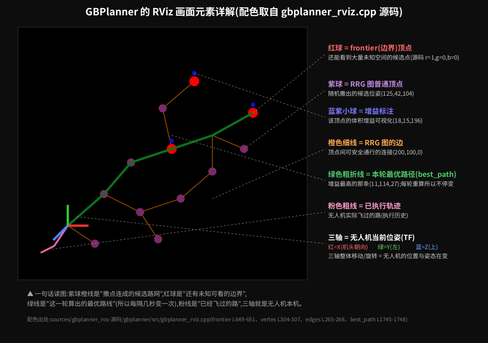

> 📌 **状态戳(2026-07-06 晚·全绿后)**:本文含历史阶段内容。**当前权威状态**以 [RESUME_新窗口接管_2026-07-06.md](../RESUME_新窗口接管_2026-07-06.md) + [Bug 台账](../docs/world-model端到端Bug台账_给作者PR.md) 为准。要点:jazzy 9/9 已验真;**run `20260706T130626` 已端到端全绿**(TASK_STATUS_OK/4探针全ok/3目标/SIM+0.72m,无hack,B15+B16 已修);但 frontier_lite 多跑基线**稳定性差**(6次全绿2/6,达标率40%,根因=启动耗时蚕食探索窗口);当前主线=**B2.5 自写薄桥接真 GBPlanner**(官方 ros1_bridge 与 zenoh 均已实验判死)→3D lidar(官方 lidar_3d 组件)→同口径对比;**PR 延后**(用户指示:等最终桥接跑通后统一定稿)。

# 体积增益与 RViz 界面详解(看懂你亲手跑通的那个画面)

> 目标:把 2026-07-02 你在 RViz 里亲眼看到的**每一个元素**讲透——红球、紫球、橙线、绿线、粉线、三色箭头,以及它们为什么会动。所有配色**逐行取自源码** `sources/gbplanner_ros-源码/gbplanner/src/gbplanner_rviz.cpp`,不是猜的。最后更新 2026-07-04。

## 一、先补课:体积增益(Volumetric Gain)到底是什么

**一句话:站在某个位置往四周"看",能新看见多少**还没探过**的空间体积,就是这个位置的体积增益。**

分四步展开:

1. **世界被切成小方块(体素,voxel)**。GBPlanner 用 voxblox 维护一张 3D 占据地图,每个体素只有三种状态:
   - **已占据**(occupied):激光打到过,这里有墙/障碍
   - **空闲**(free):激光穿过过,这里是空气
   - **未知**(unknown):激光从没照到过——**探索的目标就是消灭未知**
2. **对一个候选位置做"光线投射"(ray casting)**:从该位置朝传感器视野内的各个方向发出虚拟射线(按真实雷达的 FOV:本项目对齐 OS0-64,360°×90°、量程 20m)。每条射线一路数过去:
   - 碰到**已占据**体素 → 视线被挡,这条射线到此为止
   - 途经**未知**体素 → 计数 +1("这个位置能看见它!")
3. **增益 = 能看见的未知体素数 × 单体素体积**(所以单位是 m³)。挡在墙后的未知不算——这正是"增益"比"直接数周围未知"聪明的地方。
4. **打分与选路**:对候选路径上的各视点累计增益,再扣两笔罚分:
   ```
   score = Σ 体积增益 − λ₁·路径长度(别绕远) − λ₂·转向角度(别乱扭头)
   ```
   实测参数(预研B 抄自运行配置):`unknown_voxel_gain=60`,体素 0.2m,`v_max=1.0`。

> 直觉版:**体积增益 = "这一步能帮我揭开多少地图迷雾"**。朝开阔未知走增益高,朝墙走增益低,已探区域增益≈0。

## 二、RViz 画面逐元素详解(配注释图)



| 你看到的 | 是什么 | 源码依据(gbplanner_rviz.cpp) |
|---|---|---|
| **紫球**(实测紫红色) | **RRG 图的顶点** = 算法在自由空间里随机撒出的候选位姿 | `vertex_marker` RGB=(125,42,104),L304-307 |
| **橙色细线**(你记成"黄线"很正常,橙偏黄) | **RRG 图的边** = 两顶点之间碰撞检查通过、可安全飞行的连接 | `edge_marker` RGB=(200,100,0),L265-268 |
| **红球** | **frontier 顶点** = 增益显著的"边界点",站上去还能看见大片未知 | `frontier_marker` RGB=(1,0,0) 纯红,L649-651 |
| **蓝紫小球** | 顶点的**增益标注**(增益可视化,常叠在高增益顶点旁) | `gain` ns,RGB=(18,15,196),L674-676 |
| **深绿粗折线** | **本轮最优路径(best_path)** = 当前打分最高的那条候选路径 | `best_path` ns,RGB=(11,114,27),L1745-1748 |
| **粉色粗线** | **已执行轨迹** = 无人机实际飞过的历史路径 | 执行轨迹显示(CommandTraj/执行历史) |
| **三色直角箭头** | **无人机当前位姿(TF 坐标轴)**:红=X(机头朝向)、绿=Y(机体左)、蓝=Z(机体上) | RViz TF 显示标准配色 |
| 暗色点壳/彩色点云 | voxblox 建出的 **3D 占据地图表面** / 激光原始点云 | Voxblox / Sensors 显示项 |

## 三、动态行为:为什么它们会"动"?

### 1. 绿线为什么不停变?
GBPlanner 是**滚动重规划**:每个规划迭代(秒级)都重来一遍"撒点→建图查询→算增益→打分",然后把**新的第一名**画成绿线。地图每秒都在长(未知在减少),上一轮的最优这一轮未必还是最优——**绿线跳动 = 算法在实时"改主意",这正是'边探边规划'的直接可视化**。返航时你看到的那条稳定长线,是它在全局图上搜出的回家路径。

### 2. 紫球橙线为什么一批批刷新?
每轮迭代都重新采样局部 RRG(旧图按 `graph_lifetime` 淡出)。你看到的"球群一片片长出来又换位置",就是**每一轮的候选路网**。

### 3. 红球为什么会消失/转移?
一个 frontier 被飞过去看过之后,它周围的未知变成已知,增益掉到阈值以下,就**不再是 frontier**——红球消失。新的红球总出现在**已探区域的边缘**,这就是"探索前沿在推进"。

### 4. 三色箭头的运动意味着什么?
三轴就是**真机的实时位姿**(位置+朝向),由仿真里程计经 TF 驱动:
- **整体平移** = 无人机在飞(位置变化)
- **绕蓝轴(Z)旋转** = 偏航(转头换朝向)——GBPlanner 扣"转向罚分"惩罚的就是它转太多
- **红轴指向** = 机头方向,通常大致对准绿线的下一段
- 三轴沿着绿线走、粉线在三轴尾后延长 = **"计划(绿)—执行(粉)—本机(轴)"三者的闭环**

### 5. 时间预算到点后发生什么?(你亲眼看过)
`t=435s`(预算 480s)时日志打出 `REACHED TIME LIMIT: HOMING ENGAGED`——切换返航:绿线变成一条指回起点的路径,三轴沿它回家,最后悬停。这是 DARPA 地下赛"电池必须够回家"的工程化。

## 四、把画面串成一个故事(30 秒讲解词,可直接用于组会)

> "屏幕上紫球橙线是算法每秒在空间里撒出的**候选路网**;红球是**还有大片未知可看的边界点**;算法对每条候选路做光线投射数'能揭开多少迷雾'(体积增益),把当前第一名画成**绿色粗线**;无人机(三色箭头)沿绿线飞,飞过的路留下**粉线**;随着地图长大,绿线不断改选、红球不断向外推进——直到时间预算耗尽,它自己规划返航回到起点。整个过程没有任何人工干预。"

## 五、和 world-model 集成的关系(一句话)
frontier_lite 里**没有**这套东西——没有图、没有增益、没有绿线,只有按计时器循环的三个写死动作。我们做的 `gbplanner_gain` 决策层原型和桥接方案,就是把上面这套"看地图选路"接进 world-model 的过程(详见 [集成机制与frontier_lite缺陷_核心发现.md](集成机制与frontier_lite缺陷_核心发现.md))。

> 📷 想对照真图:重跑 `runbooks/gbplanner_ref/run_light.sh` + `takeoff_and_explore.sh`(实操手册§7),边看边对本表。
