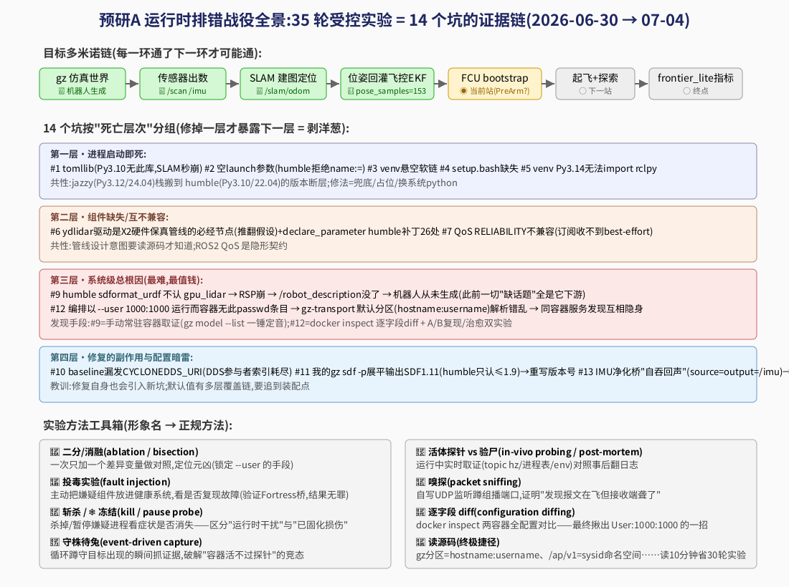

# 预研A 排错战役实录:35 轮受控实验全解(2026-06-30 → 07-04)

> **这篇文档回答三个问题**:①那几十个"端到端 run#N"到底在干什么?②每一轮干成了什么、有什么意义?③那些"投毒、斩杀、守株待兔"之类的名词是什么方法?
> 一句话总述:**每个 run 不是重复,而是一次受控实验**——带着一个明确假设、配一个定制探针进场,出场时要么排除一个假设、要么实锤一个坑。35 轮下来沉淀出 **14 个坑的完整证据链**,把 world-model 从"机器人根本没生成"推进到"位姿回灌飞控、就差解锁起飞"。
> 最后更新 2026-07-04。



## 一、总体在干什么:让 exploration 任务在本机端到端跑绿

world-model 的 `exploration` 任务一次要拉起 **9 个 Docker 容器**(Gazebo 仿真+ArduPilot 飞控+SLAM+传感器管线+控制器+工作流+录包…),这套栈是按 **jazzy(Ubuntu24.04/Python3.12)** 写的,我们在 **humble(Ubuntu22.04/Python3.10)** 上跑,版本断层埋了一路暗雷。目标多米诺链:

```
gz 世界里生成机器人 → 传感器出数(/scan /imu)→ SLAM 建图定位(/slam/odom)
→ 位姿回灌飞控 EKF(/ap/v1/pose)→ FCU 解锁起飞 → frontier_lite 真实探索 → 拿指标
```

**为什么要跑这么多轮?** 因为这类系统的故障是"套娃"的:修掉第一层死因,第二层才会暴露(日志里根本看不到)。每一轮 run 的价值 = 让下一层露头 + 验证上一个修复。这不是死循环——**blockers 从 28 → 26 → 21 → 19 一路单调收敛**,每轮都有增量。

## 二、方法工具箱(那些"新奇名词"的正规出处)

| 形象叫法 | 正规方法 | 在本战役中的用法与战果 |
|---|---|---|
| **二分/消融** | ablation / bisection(控制变量对照实验) | 编排失败但手动全绿 → 把编排与手动的差异**一次加一个**(host网络→env→hostname→挂载→user)逐个复刻,最终锁定 `--user 1000:1000` 是元凶 |
| **投毒实验** | fault injection(故障注入) | 怀疑 sensor 容器的 Fortress 代 gz 桥"毒化"发现协议 → 把它主动放进健康的手动环境 → **没复现** → 无罪释放(排除也是战果) |
| **斩杀探针** | kill probe | run 中途 `docker rm -f` 嫌疑容器,看症状是否立刻消失 → 没消失 → 排除"运行时主动干扰" |
| **冻结探针** | pause probe(SIGSTOP) | `docker pause` 全部兄弟容器(保留状态不销毁)再测 → 仍死 → 证明损伤在创建时已固化,不是兄弟们在捣乱 |
| **守株待兔** | event-driven capture(事件驱动抓取) | 容器只活十几秒、手动探针总迟到 → 写循环"每 2 秒蹲一次,目标一出现立刻 `docker inspect` 存档" |
| **活体探针** | in-vivo probing | run 进行中实时取证(`ros2 topic hz`/进程表/`/proc/PID/environ`),与"验尸"(post-mortem 翻日志)互补;本战役 v1→v23 迭代了 23 版探针 |
| **嗅探** | packet sniffing | 自写 UDP 监听蹲 gz 发现端口(239.255.0.7:10317),15 秒抓到 412 个报文 → 证明"报文在飞,接收端聋了",把问题从'没发'扭转为'收不到' |
| **组播自测** | network self-test | 20 行 Python 复刻 gz 的组播用法(1 收 1 发、3 收 1 发)→ 排除内核/网络层假设 |
| **逐字段 diff** | configuration diffing | `docker inspect` 把编排容器和手动容器的全部创建参数逐项对比 → 揪出唯一没复刻的 `User: 1000:1000` —— 一招定案 |
| **1:1 复刻** | faithful reproduction | 把编排的启动命令/env/挂载原样搬进手动容器,能在"可控慢镜头"里复现失败,才谈得上归因 |
| **冒烟测试** | smoke test | 修"启动即死"类 bug 时,先在容器里**逐段模拟启动命令**(source→source→import→--help),四段全绿再烧整轮 e2e |
| **读源码** | (终极捷径) | gz 分区=hostname:username、`/ap/v1/` 的 v1=sysid 命名空间……**读 10 分钟源码,省 30 轮实验**。战役后期的每个突破都是源码先行 |

## 三、战役编年史(每轮干了什么/成果/意义)

### 第一阶段(run#0~#3,06-30):启动即死层
| 轮次 | 假设/动作 | 结果与意义 |
|---|---|---|
| run#0 | 首跑取证 | SLAM 秒崩 `ModuleNotFoundError: tomllib` → **坑#1**(Py3.10 无 tomllib) |
| run#1(rerun) | 修 tomllib 后验证 | SLAM 越过崩溃点,撞出 `malformed launch argument` → **坑#2**(humble 拒绝空值 name:=) |
| run#2 | 修空参数后验证 | **cartographer 节点第一次真正运行**,卡"等 /scan" → 战线推进到传感器层 |
| run#3~#5 | 修 gazebo-sensor 镜像(venv 悬空/setup.bash 缺失/rclpy 版本)后逐轮验证 | 三个"同一条启动命令里的独立死点"逐个暴露逐个修 → **坑#3/#4/#5**;沉淀"冒烟测试"方法 |

### 第二阶段(run#6~#11,07-03 上午):管线与假设翻案
| 轮次 | 假设/动作 | 结果与意义 |
|---|---|---|
| run#6~#7 | X2 管线启动验证+活体探针 | 管线全起但 ydlidar 驱动缺失 → **坑#6**(推翻"仿真不需要驱动"的 6-29 假设,驱动是硬件保真管线必经节点);declare_parameter 26 处补丁在 humble 编译成功 |
| run#8~#10 | QoS 修复验证+时序抓取 | **坑#7**(RELIABILITY 不兼容);发现模拟器 `state=scanning` 但驱动 11 秒后放弃 → 数据源头没水 |
| run#11 | 渲染假设探针 | 采到 `Sensors: Waiting for init` → 一度怀疑"无 GPU 渲染挂起"(**后被证伪**,见坑#9 订正——诚实记录:这是本战役中的一次错误假设) |

### 第三阶段(手动战场,07-03 下午):绕开编排,从容取证
不再受"容器活 17 秒"限制——**手动常驻起 baseline**,想查多久查多久:
- `gz model --list` 一锤定音:**世界里根本没有 iris!** 一切"缺话题"都是它下游 → **坑#9(总根因)**:humble sdformat_urdf 不认 gpu_lidar → RSP 崩 → /robot_description 没了 → create 生成不了机器人。
- 修复(spawn 改 -file + RSP 描述展平剥 sensor)后**手动四连全绿**:RSP 活/iris 在/激光出数据/SITL JSON 接通。

### 第四阶段(run#12~#27,07-03 晚):编排环境的"幽灵"
手动全绿但编排照旧失败 → 展开系统性排除战:
| 轮次 | 假设 | 手段 | 结果 |
|---|---|---|---|
| #12~13 | 修复没进编排? | 活体验证补丁标记 | 补丁在,RSP 活,但 gz 发现瘫 |
| #14~15 | DDS 隔离? | 各容器 /proc/1/environ 对比 | **坑#10**:baseline 漏发 CYCLONEDDS_URI(修掉,但主症未解) |
| #16~18 | GZ_IP 接口漂移? | A/B 换 env | 排除 |
| #19 | Fortress 桥投毒? | 投毒实验+斩杀探针 | 排除(无罪) |
| #20 | GZ_RELAY 中继? | A/B | 排除 |
| #21 | 端口被占? | ss/netstat 双侧 | 排除(绑定正常) |
| #22 | 组播没在飞? | 嗅探 | **412 包在飞** → "发着呢,收不到" |
| #23 | 组播内核坏? | 1收/3收自测 | 排除(3/3 全收) |
| #24 | 组播路由漂移? | 加 239.255.0.7→lo 路由 | 排除 |
| #25 | 兄弟容器干扰? | 冻结全部兄弟 | 排除(仍死)→ **损伤固化在创建时** |
| #26~27 | 创建参数差异 | **守株待兔 + docker inspect 逐字段 diff** | 揪出 `User: 1000:1000` |

### 第五阶段(复现/治愈 + run#28~#35,07-03 深夜~07-04):破城
- A/B 终局实验:忠实 uid1000 复刻 → **完美复现**;仅加 `GZ_PARTITION=navlab` → **立即治愈** → **坑#12 定案**(uid 无 passwd 条目 → gz 默认分区 hostname:username 解析错乱 → 同容器发现互相隐身。此前所有 root 身份的探针读数全是"测量假象"——这条教训单独记入方法论)。
- run#28~29:分区修复 + SDF1.9 重写(**坑#11**,修我自己补丁的副作用)→ **`/scan` 7Hz、`/tf` 6.5Hz、SITL JSON 接通,感知层全线贯通**,blockers 名单质变。
- run#30~31:**坑#13**(IMU 净化桥 source=output=/imu 自吞回声 → cartographer 时序崩;两针:helpers 默认 + config 默认覆盖链)→ **SLAM 闭环打通:quality=tight、/slam/odom 真实流动**(blockers 26→21)。
- run#32~34:`/ap/v1/pose` 链——读源码确认 v1=sysid 命名空间(名字没错),时序假设证实:**controller pose_samples=153,位姿回灌成功**,状态推进到 `waiting_for_fcu_bootstrap`(blockers→19)。
- run#35:bootstrap 前沿取证 → 两条新线索:`PreArm: VisOdom not healthy` + **controller 请求 mode_id=15(AUTOTUNE)而非 4(GUIDED)** —— 疑似模式映射 bug,**当前战线(坑#14 候选)**。

## 四、诚实盘点:失败/错误/浪费(要求11,不粉饰)

| 事项 | 事实 | 处置 |
|---|---|---|
| "渲染引擎挂起"假设 | **错误假设**,消耗了 run#11 与若干分析 | 已在排错记录坑#9 中公开订正 |
| root 身份 exec 探针 | 因分区不同而"全盲",多轮读数是测量假象 | 定案后所有探针改用与服务一致的身份/env |
| 探针窗口错配 | 容器活 17s~2min,多轮探针迟到扑空 | 发明"守株待兔"式抓取;晚窗口探针 t=100 |
| 中途一些命令 shell 引号被吞(bash/WSL 双层转义) | 数次输出乱码/变量丢失 | 纪律化:一律写脚本文件执行,弃 inline 长命令 |
| WSL 空闲关机杀 docker | 多个"秒死 255"其实是环境问题不是代码问题 | keepalive 铁律(WSL使用与复现.md 铁律0) |
| GZ_IP/GZ_RELAY/组播路由三连修 | 都无效(方向错了) | 保留记录作为排除证据;教训=先 diff 配置再改网络 |
| 早期把 `%%` 说成"运行时头号根因" | 夸大(实为 tomllib) | 已在文档与 PR 物料中订正措辞 |

## 五、当前战线与下一步
- ◉ **坑#14 候选**:fcu_controller bootstrap 发 mode 15(AUTOTUNE)而非 GUIDED(4)→ 读 `navlab` fcu 控制器源码修模式映射;同时核对 `PreArm: VisOdom` 健康条件(EKF3_SRCx/VISO 参数)。
- ○ 解锁起飞 → frontier_lite 真实指标 → 预研A 终点 → 接 `gbplanner_gain`/桥接对比。

> 复用脚本已归档:`runbooks/diagnostics/`(探针/复刻/自测,均带注释)。逐坑证据链详录:[运行时排错记录_humble.md](运行时排错记录_humble.md)。
