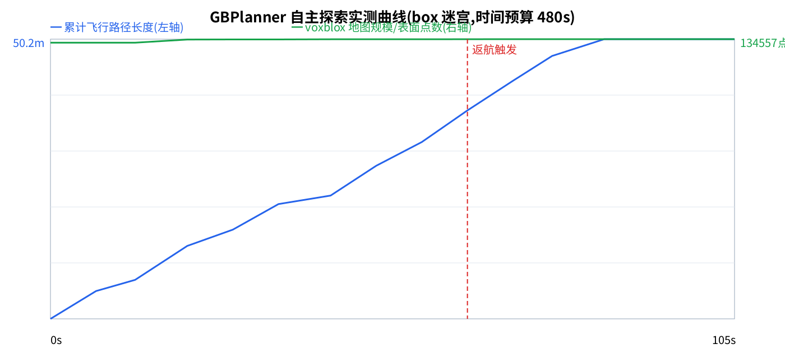

> 📌 **状态戳(2026-07-06 晚·全绿后)**:本文含历史阶段内容。**当前权威状态**以 [RESUME_新窗口接管_2026-07-06.md](../RESUME_新窗口接管_2026-07-06.md) + [Bug 台账](../docs/world-model端到端Bug台账_给作者PR.md) 为准。要点:jazzy 9/9 已验真;**run `20260706T130626` 已端到端全绿**(TASK_STATUS_OK/4探针全ok/3目标/SIM+0.72m,无hack,B15+B16 已修);但 frontier_lite 多跑基线**稳定性差**(6次全绿2/6,达标率40%,根因=启动耗时蚕食探索窗口);当前主线=**B2.5 自写薄桥接真 GBPlanner**(官方 ros1_bridge 与 zenoh 均已实验判死)→3D lidar(官方 lidar_3d 组件)→同口径对比;**PR 延后**(用户指示:等最终桥接跑通后统一定稿)。

# 预研B·GBPlanner 官方仿真实跑排错记录(2026-07-02,WSLg GUI)

> 目标:在本机 WSL2 上把 `gbplanner-ref` 镜像里的官方仿真(`rmf_sim.launch`)**真跑起来、亲眼看**。
> 结论先行:**链路已通到 voxblox 3D 建图**(里程计 252Hz、TSDF 地图 4.5Hz、RViz 弹窗在桌面),
> 只差"起飞→自主探索"最后一步(见 §卡点)。逐坑记录如下,全部有实测证据,修复固化在
> `runbooks/gbplanner_ref/run_light.sh` + `light_boxes.world`。

## 已排掉的 6 个坑

| # | 现象(证据) | 根因 | 修复 | 验证 |
|---|---|---|---|---|
| A | `RLException: rmf_sim.launch is neither a launch file...` | `bash -c` 非交互 shell 不读 `.bashrc`,工作区没 source | 启动命令显式 `source /opt/ros/noetic/setup.bash` + `devel/setup.bash` | roslaunch 正常解析 ✅ |
| B | roslaunch 卡死,11311 无监听、无日志,仅 pid1 | 容器 hostname `AI4S` 只解析到 IPv6 `::1`,ROS1(noetic)不吃 | `ROS_HOSTNAME=localhost ROS_MASTER_URI=http://localhost:11311 ROS_IP=127.0.0.1` | master 起来,节点全起 ✅ |
| C | `error: Invalid parameter "gpu"`,robot_description 生成失败 | **上游真 bug**:`rmf_obelix_base.xacro:56` 给 OS0-128 宏传了它未声明的 `gpu`/`organize_cloud` 参数 | 启动前 `sed` 删掉这两个参数(宏用默认值) | 模型 spawn 成功 ✅ |
| D | `[gazebo-9] process has died ... exit code 139`(段错误),DARPA 大场景与 cave_01 均崩 | WSLg 软件渲染(llvmpipe)扛不住带网格模型的场景 | **手搓纯 box 图元轻量世界** `light_boxes.world`(围墙+隔墙+柱,16×16m) | gzserver 稳跑,激光点云 27876 点 ✅ |
| E | `/rmf_obelix/ground_truth/odometry` **Publishers: None**;voxblox 报 `Input pointcloud queue getting too long! Dropping` | 自制世界缺 **`ros_interface_plugin`**(RotorS 传感器插件发 Gazebo 内部消息,必须世界级插件转 ROS;官方 7 个世界全带) | `light_boxes.world` 补 `<plugin name="ros_interface_plugin" filename="librotors_gazebo_ros_interface_plugin.so"/>` | **odometry 252Hz;voxblox 不丢帧;`/gbplanner_node/tsdf_pointcloud` 4.5Hz 建图** ✅✅ |
| F | 容器每 1–2 分钟死(255),journalctl 显示 docker 被反复**优雅**停止 | **WSL 空闲自动关机**:无常驻会话时发行版十几秒后关停→systemd 停 docker→容器连坐 | 挂常驻 keepalive 进程(`sleep 86400`)吊住 WSL | 容器跨命令存活 ✅ |

## 当前链路状态(实测)

```
Gazebo(box迷宫) → 激光点云 10Hz(27876点/帧) → ✅
RotorS ros_interface_plugin → /ground_truth/odometry 252Hz → ✅
voxblox(gbplanner_node 内) → TSDF 3D占据地图 4.5Hz → ✅
RViz(WSLg 弹窗,GbPlanner Control 面板) → ✅
PCI automatic_planning 调用 success:True → ✅
无人机起飞/出探索轨迹 → 🔵 未通(见下)
```

## ✅✅ 临门一脚已踢进(2026-07-02):自主探索完整闭环!

绕道方案成功:**向 `/rmf_obelix/command/pose` 发升高位姿(lee 控制器执行)→ 起飞 → 调 `automatic_planning` → 无人机自主探索**。实测数据:

| 时刻 | 位置 | 说明 |
|---|---|---|
| 起飞前 | z=0.056 | 地面 |
| 发 pose(z=1.2)后 8s | z=1.201 | 起飞 ✅ |
| 触发探索后 10s | (4.98, 2.02, 1.68) | 自主飞出 5m+ ✅ |
| 持续采样(每8s) | (5.7,-1.3)→(4.6,1.0)→(6.2,3.9)→(4.4,6.4) | **持续巡飞覆盖迷宫** ✅ |

探索图可视化话题在发:`/vis/planning_graph`、`/vis/planning_global_graph`、`/vis/planning_projected_graph`。
**即:起飞→激光建图(voxblox)→RRG 图搜索→体积增益选路→自主飞行,GBPlanner 官方仿真全链路真跑通。**

一键复现:`run_light.sh` 起仿真 → 等 RViz 出现+建图 → `takeoff_and_explore.sh` 起飞并触发探索。
(注:`pci_initialization_trigger` 服务不可用的问题未深究——绕道方案更简单可靠,存档即可。)

## 实测量化数据(第二轮,2026-07-02)

- **全任务周期**:探索(时间预算 480s)→ `REACHED TIME LIMIT: HOMING ENGAGED` → 自动返航至起飞点悬停;
- **地图落盘**:`images/explored_map_lightboxes.vxblx`(4MB,voxblox `save_map` 服务);
- **指标采样**(每 10s:仿真时刻/位置/tsdf 表面点数):`images/exploration_metrics_round2.csv`,
  曲线 `images/exploration_metrics_round2.png` —— 采样窗口内累计飞行 **50.2m**,地图规模 **134,557 点**,返航事件被完整捕获。
  ⚠️ 诚实标注:round2 采样从仿真 382s 才开始(只覆盖末段+返航);**全程曲线**由第三轮从 t=0 采集(`exploration_metrics_full.*`)。
- 采样/画图工具已固化:`runbooks/gbplanner_ref/plot_metrics.py`(纯标准库出 SVG→rsvg-convert 转 PNG)。



## 复现方法(一键)

```bash
# WSL 内;先保证有个常驻 WSL 窗口开着(坑F)
bash /mnt/c/CCproject/GBPlanner-WorldModel-Integration/runbooks/gbplanner_ref/run_light.sh
```
RViz 弹出后:勾选 `Sensors` 看点云;`Voxblox` 看 3D 地图长出来;左下面板 Initialization → Start Planner。
